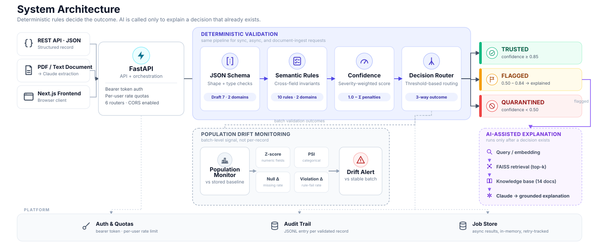
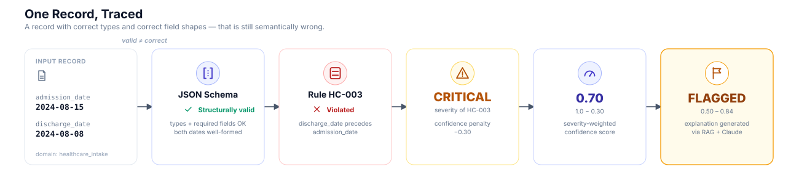

# SchemaGuard

**Semantic validation, drift detection, and explainability for LLM-generated structured data.**

LLMs and document-extraction pipelines produce JSON that is structurally correct and still wrong. SchemaGuard adds a deterministic layer on top of schema validation — cross-field rules, confidence scoring, and decision routing — so a record has to make sense, not just parse.

**JSON Schema validates structure. SchemaGuard validates meaning.**

<p align="center">
  
</p>

## The problem

```json
{
  "admission_date": "2024-08-15",
  "discharge_date": "2024-08-08"
}
```

Both fields are correctly-typed dates. JSON Schema passes this record. But the patient is discharged a week before being admitted — a logically impossible record that a type checker will never catch, and that flows silently into claims processing, billing, or analytics downstream.

## How it works

Every record — whether it arrives via the API, a batch upload, or document ingestion — runs through the same four-stage pipeline (`validator/pipeline.py`):

1. **JSON Schema** checks shape and types against a Draft 7 schema for the domain.
2. **Semantic rules** check the things a schema can't express — cross-field invariants like `discharge_date ≥ admission_date` or `loan_amount / annual_income ≤ 10×`.
3. **Confidence scoring** starts at 1.0 and subtracts a fixed penalty per violation (critical −0.30, warning −0.12).
4. **Decision routing** maps the score to `trusted` (≥ 0.85), `flagged` (0.50–0.84), or `quarantined` (< 0.50).

Only *flagged* records go on to get an AI-generated explanation — the decision itself is already final by that point.

<p align="center">
  
</p>

```bash
curl -s -X POST http://localhost:8000/validate \
  -H "Content-Type: application/json" \
  -d '{
    "domain": "healthcare_intake",
    "record": {
      "patient_id": "P-4412", "first_name": "Sarah", "last_name": "Mitchell",
      "date_of_birth": "1990-01-20", "gender": "female",
      "admission_date": "2024-08-15", "discharge_date": "2024-08-08",
      "diagnosis_code": "N39.0", "medication": "Ciprofloxacin",
      "patient_age": 34, "emergency_admission": false
    }
  }'
```

```json
{
  "decision": "flagged",
  "confidence_score": 0.7,
  "violated_rules": [
    {
      "rule_id": "HC-003",
      "severity": "critical",
      "message": "Discharge date (2024-08-08) precedes admission date (2024-08-15)"
    }
  ]
}
```

**Healthcare Intake**

| Rule | Cross-field check | Severity |
|------|-------------------|:--------:|
| HC-001 | `patient_age` matches computed age from DOB (±1 yr) | Critical |
| HC-002 | `admission_date ≥ date_of_birth` | Critical |
| HC-003 | `discharge_date ≥ admission_date` | Critical |
| HC-004 | `diagnosis_code` is age-appropriate per ICD-10-CM edit table | Warning |
| HC-005 | `medication` is plausible for the diagnosis category | Warning |

**Financial Loan Application**

| Rule | Cross-field check | Severity |
|------|-------------------|:--------:|
| FN-001 | `approval_date ≥ application_date` (or null) | Critical |
| FN-002 | `loan_amount / annual_income ≤ 10×` | Critical |
| FN-003 | `existing_debt / annual_income ≤ 60%` | Warning |
| FN-004 | `employment_length_years ≤ (age − 16)` | Critical |
| FN-005 | `approved_amount ≤ loan_amount` (or null) | Critical |

## Engineering highlights

**Deterministic validation, isolated from the LLM path.** `validate_record()` runs the same four stages regardless of whether the request came from `/validate`, the async queue, or document ingestion. The Claude call in the RAG explainer happens strictly after this function returns — it receives an already-final decision and a list of violations, and cannot change either. This keeps validation reproducible: the same input always produces the same decision, with no model-call latency or non-determinism on the critical path.

**Confidence is arithmetic, not a heuristic.** `1.0 − Σ(severity penalty)`, clamped to `[0, 1]`. Two people reading the code can hand-compute the score for any record; there's nothing to tune except the penalty table.

**Explanations are retrieval-grounded, not free-form.** `/rag/explain` builds a query from the violated rule IDs, retrieves the top-k passages from a 14-document knowledge base via FAISS (`IndexFlatIP`, `all-MiniLM-L6-v2` embeddings), and passes only that retrieved text to Claude alongside the violation. The response includes the retrieved chunks and their sources, so the explanation can be checked against what it was actually grounded in.

**Drift is a batch-level signal, not a per-record one.** A single bad record is a validation failure. A population that quietly shifts — a data source that starts sending systematically older patients, or lower incomes — can stay individually "valid enough" to pass every rule while the underlying distribution moves. `POST /batch-validate` profiles each batch against a stored baseline on four independent signals (z-score for numeric fields, PSI for categorical fields, null-rate delta, violation-rate delta) specifically to catch that case.

**The async path reuses the sync pipeline.** `pipeline/async_processor.py` is an in-memory job queue with bounded concurrency (`asyncio.Semaphore(10)`) and retry-on-failure (up to 2 attempts before a job is marked failed) — but the actual validation call inside it is the same `validate_record()` function used by the synchronous endpoint. There is one pipeline, entered from three places (sync, async, document ingest).

**Document ingestion uses the LLM only for extraction.** `POST /ingest/upload` sends PDF/text content to Claude to extract structured fields, then runs the result through the identical validation pipeline as any other record. The model's role there is OCR-adjacent field extraction — it still doesn't get a vote on whether the extracted record is valid.

## RAG-grounded explanations

Flagged and quarantined records get an explanation instead of just a rule ID. The retrieval corpus is domain reference material — CMS, HL7 FHIR, ICD-10-CM, CFPB, Regulation Z, ECOA, Fannie Mae guidance — chunked and embedded once (`python3 rag/vector_store.py --build`) into a FAISS index. At request time, `/rag/explain` retrieves the passages relevant to the specific violated rule and includes them in the prompt, so the explanation cites the same source a compliance reviewer would.

## Drift detection

Rules operate on one record at a time and can't see the batch it came from. `drift/` builds a baseline profile per domain (mean/std for numeric fields, category frequencies, null rates, violation rates) and compares new batches against it whenever `/batch-validate` runs, flagging any of the four signals above that crosses its threshold.

## Evaluation

Numbers below come from running the test suites and reading `evaluation/results/*.json` directly — not from documentation that predates the code.

| Metric | Result |
|--------|--------|
| Total tests | **190 / 190** passing (58 integration + 79 production + 53 adversarial) |
| Precision / Recall / F1 | 1.0 / 1.0 / 1.0 on both domains |
| False quarantine rate | 0% — no valid record incorrectly blocked |
| Median validation latency | ~0.09 ms |
| Throughput | ~3,800 records/sec (single process) |
| Drift scenarios detected | 6 / 6, with 0 / 2 false alarms on stable batches |

F1 = 1.0 reflects a deterministic engine scored against data written to exercise its own rules — it confirms correct implementation, not generalization to unseen distributions. The adversarial suite (25 noise-injection cases, 20 exact-boundary probes, 8 compound-violation cases) is the more meaningful check: 53/53 handled correctly with no crashes and no false quarantines.

```bash
python3 -m evaluation.integration_test        # 58 assertions
python3 -m evaluation.production_test         # 79 assertions
python3 -m evaluation.adversarial_evaluation  # 53 assertions
python3 -m pytest evaluation/                 # pytest-discoverable subset
```

## Tech stack

| Layer | Technology |
|-------|-----------|
| Language | Python 3.12 |
| API | FastAPI, Pydantic v2, Uvicorn |
| Frontend | Next.js 14, React 18, Tailwind CSS |
| LLM | Anthropic Claude |
| Vector store | FAISS (`IndexFlatIP`, cosine similarity) |
| Embeddings | `sentence-transformers` (`all-MiniLM-L6-v2`) |
| Schema validation | `jsonschema` (Draft 7) |
| Testing | pytest + custom assertion-based evaluation runners |

## API

| Method | Path | Description |
|--------|------|-------------|
| `GET` | `/health` | Service status |
| `GET` | `/example` | Sample record for a domain |
| `POST` | `/validate` | Single record validation |
| `POST` | `/batch-validate` | Batch validation + drift detection |
| `POST` | `/suggest/suggest-fix` | Field-level correction suggestions |
| `GET` | `/suggest/suggest-fix/rules` | Rules with suggestion support |
| `POST` | `/rag/explain` | Validate + RAG-grounded explanation |
| `GET` | `/rag/status` | Check whether the FAISS index is built |
| `POST` | `/rag/search` | Search the knowledge base directly |
| `POST` | `/ingest/upload` | Upload PDF/text → extract → validate |
| `GET` | `/ingest/supported-domains` | List supported domains and file types |
| `POST` | `/async/submit` | Submit an async validation job |
| `GET` | `/async/result/{job_id}` | Fetch an async job's result |
| `GET` | `/user/audit` | Per-user audit log |

Full interactive docs at `http://localhost:8000/docs`.

## Run locally

```bash
git clone https://github.com/PragatiAN1109/schema-guard-llm-validation.git
cd schema-guard-llm-validation

# Backend
pip install -r requirements.txt
cp .env.example .env   # add ANTHROPIC_API_KEY for RAG explanations & document ingest
./run_backend.sh
# → http://localhost:8000/docs

# Frontend (separate terminal)
cd frontend
npm install
npm run dev
# → http://localhost:3000
```

Build the RAG index once before using `/rag/explain`:

```bash
python3 rag/vector_store.py --build
```

Deployment is defined in [`render.yaml`](render.yaml) — FastAPI backend and Next.js frontend as two Render web services.

## Project structure

```
schema-guard-llm-validation/
├── api/            FastAPI app: validate, async, user, RAG, ingest, suggest routers
├── validator/      Core pipeline — structural → semantic → scoring → routing
├── rules/          Rule registry + the 10 cross-field rule functions
├── schemas/        JSON Schema (Draft 7) for both domains
├── scoring/        Confidence scorer + decision router
├── suggestions/    Correction suggestion engine
├── drift/          Baseline profiling + 4-signal drift detector
├── rag/            FAISS vector store, chunker, and RAG explainer
├── ingest/         Document upload → Claude extraction → validation
├── pipeline/       Async job queue and processor
├── auth/           Token-based API authentication
├── analytics/      Usage tracking and audit logging
├── frontend/       Next.js 14 console UI
├── data_gen/       Synthetic dataset generator for both domains
└── evaluation/     Test suites, metrics, and evaluation artifacts
```

## Design principle

The rule engine decides. The model explains. Keeping those two jobs on opposite sides of a function boundary is what makes the decision reproducible, testable, and auditable — and it's the only reason the explanation layer is allowed to be as flexible as an LLM.

## License

MIT — see [LICENSE](LICENSE).
