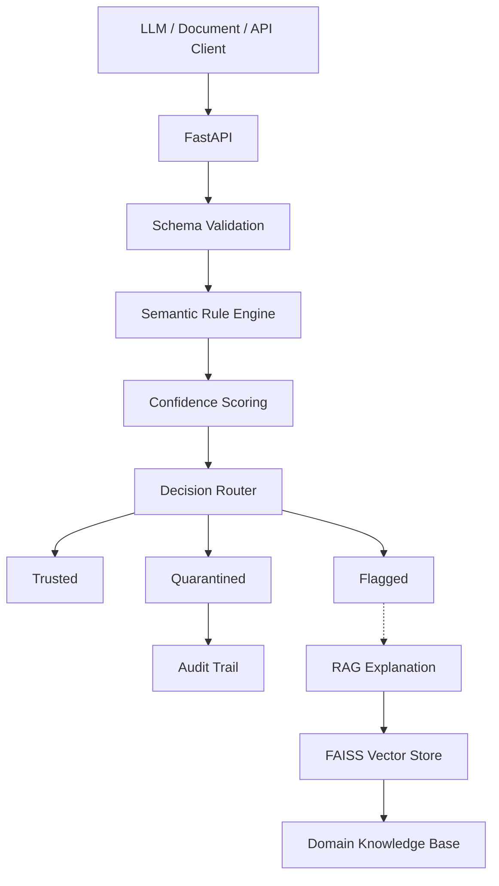
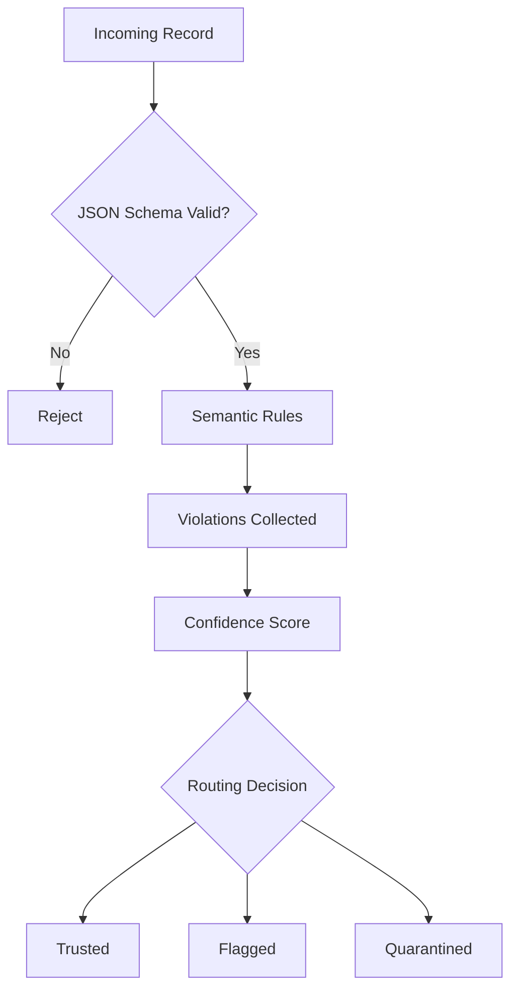
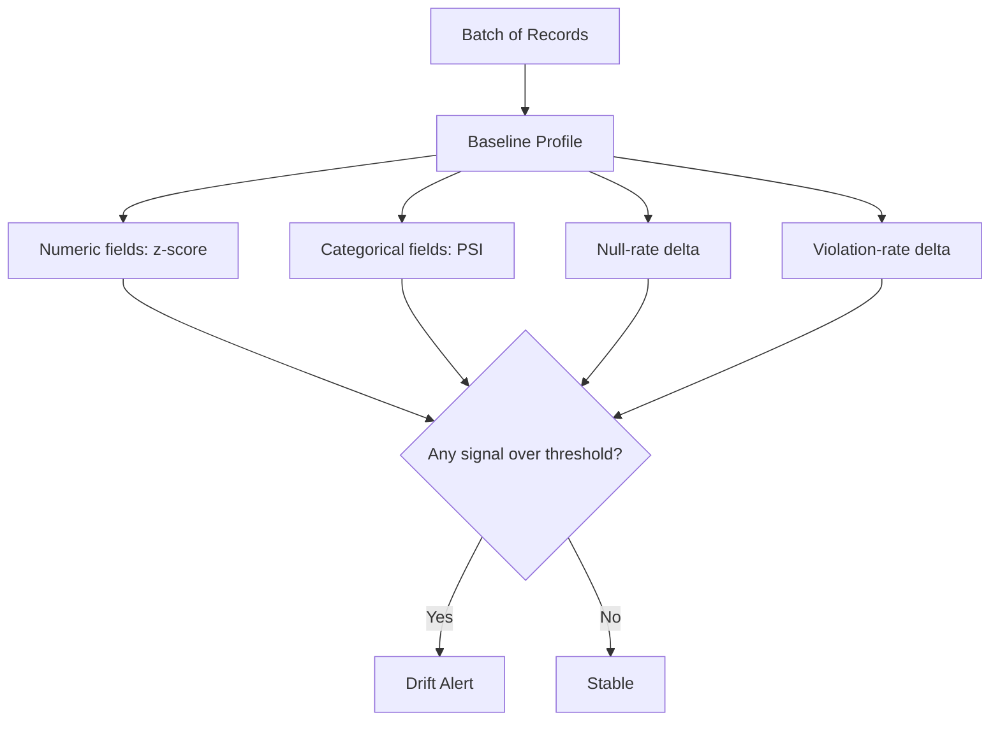
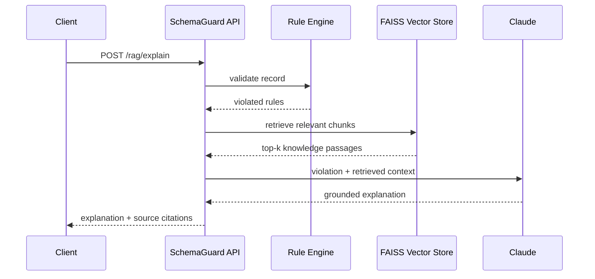

<div align="center">

# SchemaGuard

**Semantic Validation, Drift Detection & Explainability for LLM-Generated Structured Data**

<p>
  
  
  
  
  
</p>

</div>

---

## Problem

JSON Schema confirms a record has the right *types* and *shape*. It cannot confirm the record makes sense.

```json
{
  "admission_date": "2026-08-15",
  "discharge_date": "2026-08-08"
}
```

Both fields are correctly-typed dates. Schema validation passes. But the patient is discharged a week before being admitted — a logically impossible record that flows silently downstream (claim rejection, miscalculated billing, corrupted analytics).

**JSON Schema validates structure. SchemaGuard validates meaning.**

It layers a deterministic, cross-field semantic rule engine, confidence scoring, and decision routing on top of schema validation — so structurally-valid-but-logically-broken records get caught before they reach production.

---

## Architecture



## Validation Pipeline



Confidence is computed deterministically from violation severity:

```
score = 1.0 − 0.30 × |critical violations| − 0.12 × |warning violations|
score = max(0.0, min(1.0, score))
```

| Score range | Decision |
|:-----------:|----------|
| ≥ 0.85 | ✅ Trusted |
| 0.50 – 0.84 | ⚠️ Flagged |
| < 0.50 | ❌ Quarantined |

---

## Example

```bash
curl -s -X POST http://localhost:8000/validate \
  -H "Content-Type: application/json" \
  -d '{
    "domain": "healthcare_intake",
    "record": {
      "patient_id": "P-4412", "first_name": "Sarah", "last_name": "Mitchell",
      "date_of_birth": "1990-01-20", "gender": "female",
      "admission_date": "2024-08-15",
      "discharge_date": "2024-08-08",
      "diagnosis_code": "N39.0", "medication": "Ciprofloxacin",
      "patient_age": 34, "emergency_admission": false
    }
  }'
```

```json
{
  "decision": "flagged",
  "confidence_score": 0.7,
  "violated_rules": [
    {
      "rule_id": "HC-003",
      "severity": "critical",
      "message": "Discharge date (2024-08-08) precedes admission date (2024-08-15)"
    }
  ]
}
```

### The 10 semantic rules

**Healthcare Intake**

| Rule | Cross-field check | Severity | Regulatory reference |
|------|-------------------|:--------:|----------------|
| HC-001 | `patient_age` matches computed age from DOB (±1 yr) | 🔴 Critical | CMS CoP §482.24(c) |
| HC-002 | `admission_date ≥ date_of_birth` | 🔴 Critical | HL7 FHIR R4 Encounter |
| HC-003 | `discharge_date ≥ admission_date` | 🔴 Critical | NUBC UB-04 FL6/FL16 |
| HC-004 | `diagnosis_code` is age-appropriate per ICD-10-CM edit table | 🟡 Warning | ICD-10-CM FY2024 Guidelines |
| HC-005 | `medication` is plausible for the diagnosis category | 🟡 Warning | ISMP Medication Safety Alert |

**Financial Loan Application**

| Rule | Cross-field check | Severity | Regulatory reference |
|------|-------------------|:--------:|----------------|
| FN-001 | `approval_date ≥ application_date` (or null) | 🔴 Critical | CFPB TRID §1026.19 |
| FN-002 | `loan_amount / annual_income ≤ 10×` | 🔴 Critical | CFPB ATR Rule 12 CFR §1026.43 |
| FN-003 | `existing_debt / annual_income ≤ 60%` | 🟡 Warning | Fannie Mae DU §B3-6-02 |
| FN-004 | `employment_length_years ≤ (age − 16)` | 🔴 Critical | CFPB ATR §1026.43(c)(3) |
| FN-005 | `approved_amount ≤ loan_amount` (or null) | 🔴 Critical | ECOA Regulation B §1002.9 |

---

## Key Capabilities

- **JSON Schema structural validation** — Draft 7 schemas for each domain
- **Deterministic semantic rules** — 10 cross-field rules across two domains, fully unit-testable
- **Confidence scoring** — severity-weighted, reproducible on every run
- **Decision routing** — trusted / flagged / quarantined with configurable thresholds
- **Batch validation** — `POST /batch-validate`, runs drift detection across the batch
- **Population drift detection** — z-score, PSI, null-rate delta, violation-rate delta
- **Correction suggestions** — auto-fix / probable-fix / manual-review tiers
- **RAG-grounded explanations** — FAISS retrieval over a domain knowledge base, generated by Claude
- **Document ingestion** — upload a PDF or text document, extract structured JSON, validate it
- **Async processing** — job queue with retry and dead-letter handling
- **Audit logging** — full JSONL history with confidence scores per record
- **Observability** — latency histograms and request tracing

---

## Why deterministic validation + LLM explanations

The LLM does not decide whether a record is valid. Validity is decided by explicit, versioned business rules — testable, predictable, low-latency, and auditable in a way a model call never is.

The LLM's job starts *after* a rule has already fired: turning a rule violation into a explanation a human can act on, grounded in retrieved domain documentation instead of a free-form guess.

> Use deterministic systems to decide whether structured data is valid. Use LLMs to help humans understand why it is not.

---

## Drift Detection

Rules catch a single bad record. They don't catch a population quietly shifting underneath the rules — an upstream data source that starts sending systematically different values while individually staying "valid enough" to pass rule checks. `drift/` profiles a baseline batch and compares new batches against it on four independent signals:



## RAG Explanation Flow



The knowledge base (`rag/knowledge_base.py`) is 14 domain-reference documents (CMS, HL7 FHIR, ICD-10-CM, CFPB, Reg Z, ECOA, Fannie Mae guidance), chunked and embedded with `sentence-transformers` into a FAISS `IndexFlatIP` index.

---

## Evaluation

Numbers below are reproduced from live test runs and the JSON artifacts in `evaluation/results/` — not hand-copied marketing figures.

| Metric | Result |
|--------|--------|
| Total tests | **190 / 190** passing (58 integration + 79 production + 53 adversarial) |
| Precision / Recall / F1 | 1.0 / 1.0 / 1.0 on both domains |
| False quarantine rate | 0% — no valid record incorrectly blocked |
| Median validation latency | ~0.09 ms |
| Throughput | ~3,800 records/sec (single process) |
| Drift scenarios detected | 6 / 6, with 0 / 2 false alarms on stable batches |

> F1 = 1.0 reflects a deterministic rule engine scored against data designed to exercise its own rules — it confirms correct implementation, not generalization. The adversarial suite (noise injection, exact boundary probing, compound violations) is the more meaningful robustness signal: 53/53 cases handled correctly with zero crashes.

Run it yourself:

```bash
python3 -m evaluation.integration_test        # 58 assertions
python3 -m evaluation.production_test         # 79 assertions
python3 -m evaluation.adversarial_evaluation  # 53 assertions
python3 -m pytest evaluation/                 # pytest-discoverable subset
```

---

## Technology

| Layer | Technology |
|-------|-----------|
| Language | Python 3.12 |
| API | FastAPI, Pydantic v2, Uvicorn |
| Frontend | Next.js 14, React 18, Tailwind CSS |
| LLM | Anthropic Claude |
| Vector store | FAISS (`IndexFlatIP`, cosine similarity) |
| Embeddings | `sentence-transformers` (`all-MiniLM-L6-v2`) |
| Schema validation | `jsonschema` (Draft 7) |
| Drift detection | z-score, PSI, null-rate delta, violation-rate delta |
| Testing | pytest + custom assertion-based evaluation runners |

---

## Run Locally

```bash
git clone https://github.com/PragatiAN1109/schema-guard-llm-validation.git
cd schema-guard-llm-validation

# Backend
pip install -r requirements.txt
cp .env.example .env   # add ANTHROPIC_API_KEY for RAG explanations & document ingest
./run_backend.sh
# → http://localhost:8000/docs

# Frontend (separate terminal)
cd frontend
npm install
npm run dev
# → http://localhost:3000
```

Build the RAG index once before using `/rag/explain`:

```bash
python3 rag/vector_store.py --build
```

Deployment is defined in [`render.yaml`](render.yaml) (FastAPI backend + Next.js frontend as two Render web services).

---

## API

| Method | Path | Description |
|--------|------|-------------|
| `GET` | `/health` | Service status |
| `GET` | `/example` | Sample record for a domain |
| `POST` | `/validate` | Single record validation |
| `POST` | `/batch-validate` | Batch validation + drift detection |
| `POST` | `/suggest/suggest-fix` | Field-level correction suggestions |
| `GET` | `/suggest/suggest-fix/rules` | Rules with suggestion support |
| `POST` | `/rag/explain` | Validate + RAG-grounded explanation |
| `GET` | `/rag/status` | Check whether the FAISS index is built |
| `POST` | `/rag/search` | Search the knowledge base directly |
| `POST` | `/ingest/upload` | Upload PDF/text → extract → validate |
| `GET` | `/ingest/supported-domains` | List supported domains and file types |
| `POST` | `/async/submit` | Submit an async validation job |
| `GET` | `/async/result/{job_id}` | Fetch an async job's result |
| `GET` | `/user/audit` | Per-user audit log |

Full interactive docs at `http://localhost:8000/docs`.

---

## Project Structure

```
schema-guard-llm-validation/
├── api/            FastAPI app: validate, async, user, RAG, ingest, suggest routers
├── validator/      Core pipeline — structural → semantic → scoring → routing
├── rules/          Rule registry + the 10 cross-field rule functions
├── schemas/        JSON Schema (Draft 7) for both domains
├── scoring/        Confidence scorer + decision router
├── suggestions/    Correction suggestion engine
├── drift/          Baseline profiling + 4-signal drift detector
├── rag/            FAISS vector store, chunker, and RAG explainer
├── ingest/         Document upload → LLM extraction → validation
├── pipeline/       Async job queue and processor
├── auth/           Token-based API authentication
├── analytics/      Usage tracking and audit logging
├── observability/  Metrics and tracing
├── resilience/     Circuit breakers for drift/semantic/storage calls
├── frontend/       Next.js 14 console UI
├── data_gen/       Synthetic dataset generator for both domains
└── evaluation/     Test suites, metrics, and evaluation artifacts
```

---

## Design Principle

Validation decisions come from explicit, testable rules — not from an LLM's judgment call. The model's role is explanation, not adjudication: it helps a human understand a violation that a deterministic engine already found.

## License

MIT — see [LICENSE](LICENSE).
