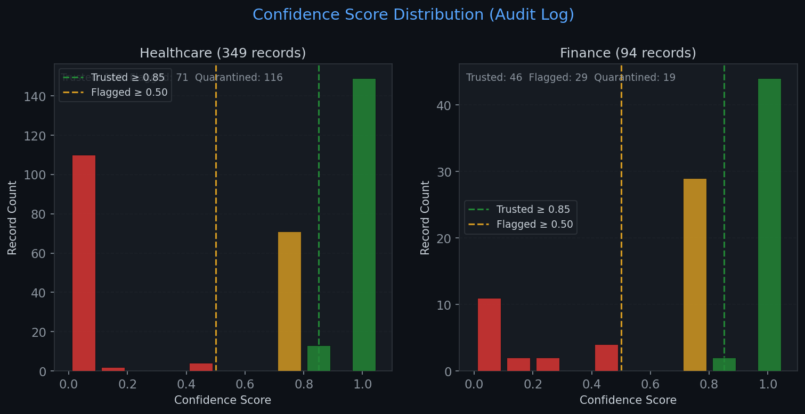
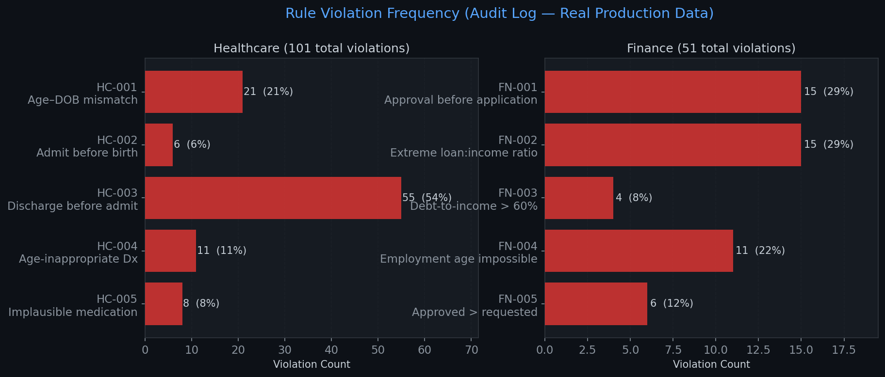
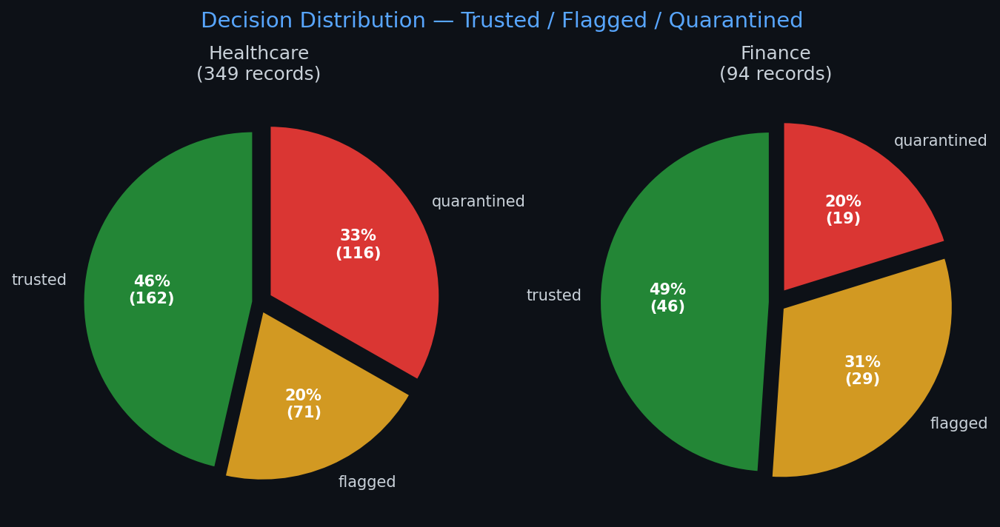
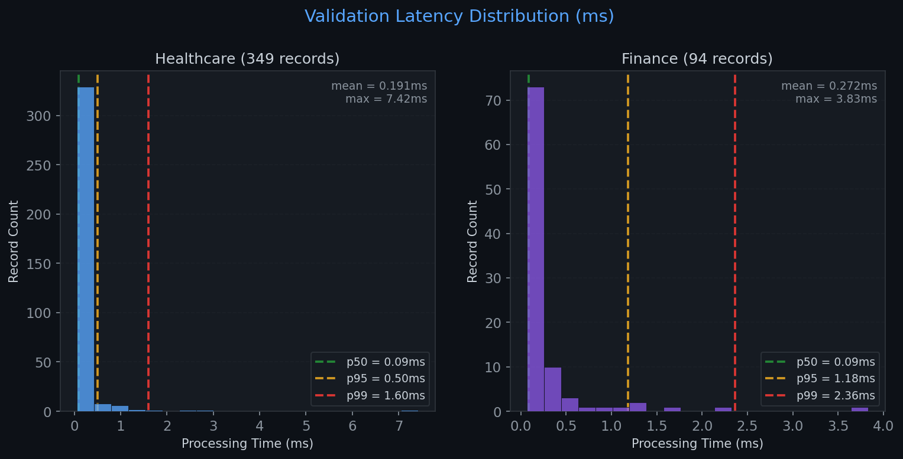
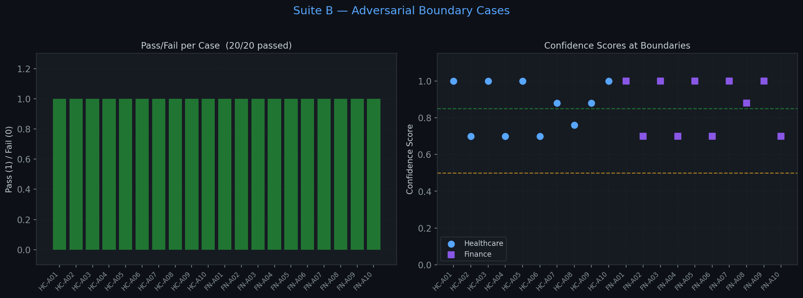
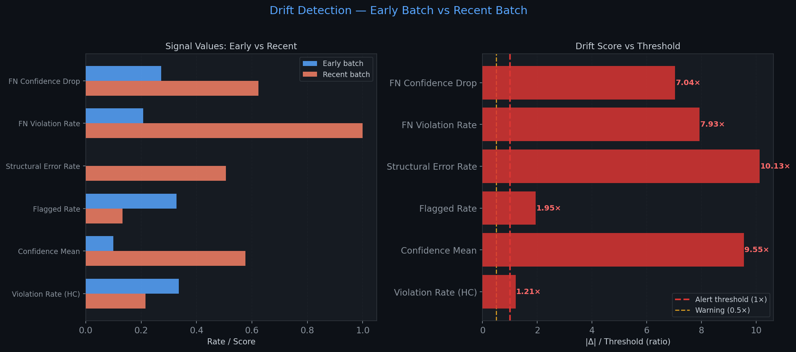
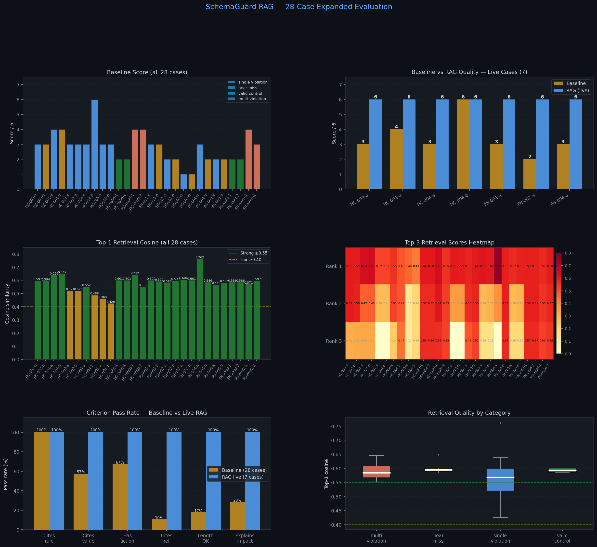
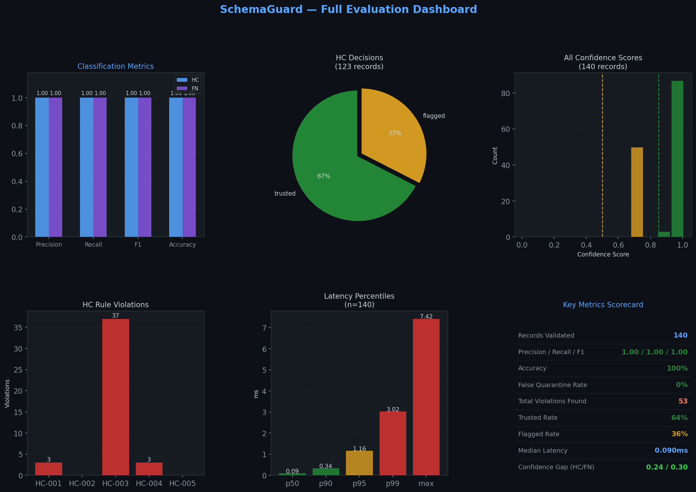

<div align="center">

<h1>SchemaGuard</h1>

<p><strong>Semantic Validation & Drift Detection for LLM-Generated Structured Outputs</strong></p>

<p>
  <a href="https://python.org"></a>
  <a href="https://fastapi.tiangolo.com"></a>
  <a href="https://nextjs.org"></a>
  
  
  
  <a href="https://northeastern.edu"></a>
</p>

<p><em>LLMs generate structurally valid JSON that is semantically wrong. SchemaGuard catches what schema validation misses.</em></p>

</div>

---

## The Problem

When LLMs generate structured records, the output passes JSON Schema validation perfectly — but the data can be logically impossible:

| Record | Violation | Passes JSON Schema? | Consequence |
|--------|-----------|:---:|---|
| Discharge 7 days **before** admission | `discharge_date < admission_date` | ✅ Yes | DRG miscalculation · UB-04 claim rejected |
| Loan = **52×** annual income | `loan_amount / income = 52` | ✅ Yes | CFPB ATR violation · QM ineligible |
| Age-related osteoporosis in a **5-year-old** | Adult-only ICD-10 code M81.0 | ✅ Yes | CMS NCCI edit failure |
| Approved **22 days before** applying | `approval_date < application_date` | ✅ Yes | TILA-RESPA disclosure violation |

Every one flows silently into production. **SchemaGuard stops them.**

---

## System Architecture


### Pipeline Flow


---

## Before vs After


---

## Quick Start

```bash
# 1. Clone and install
git clone https://github.com/PragatiAN1109/schema-guard-llm-validation.git
cd schema-guard-llm-validation
pip install -r requirements.txt

# 2. Set API key (required for RAG explanations)
echo "ANTHROPIC_API_KEY=sk-ant-..." >> .env

# 3. Start the API server
./run_backend.sh
# → http://localhost:8000/docs

# 4. (Optional) Start the console UI
cd frontend && node_modules/.bin/next dev --port 3000
# → http://localhost:3000
```

**Validate a record in one curl:**

```bash
curl -s -X POST http://localhost:8000/validate \
  -H "Content-Type: application/json" \
  -d '{
    "domain": "healthcare_intake",
    "record": {
      "patient_id": "P-4412", "first_name": "Sarah", "last_name": "Mitchell",
      "date_of_birth": "1990-01-20", "gender": "female",
      "admission_date": "2024-08-15",
      "discharge_date": "2024-08-08",
      "diagnosis_code": "N39.0", "medication": "Ciprofloxacin",
      "patient_age": 34, "emergency_admission": false
    }
  }' | python3 -m json.tool
```

```json
{
  "decision": "flagged",
  "confidence_score": 0.7,
  "violated_rules": [
    {
      "rule_id": "HC-003",
      "severity": "critical",
      "message": "Discharge date (2024-08-08) precedes admission date (2024-08-15)"
    }
  ]
}
```

---

## The 10 Semantic Rules


### Healthcare Intake (HC-001 – HC-005)

| Rule | Cross-Field Check | Severity | Regulatory Ref |
|------|-------------------|:--------:|----------------|
| HC-001 | `patient_age` matches computed age from DOB + admission date (±1 yr) | 🔴 Critical | CMS CoP §482.24(c) |
| HC-002 | `admission_date ≥ date_of_birth` | 🔴 Critical | HL7 FHIR R4 Encounter |
| HC-003 | `discharge_date ≥ admission_date` | 🔴 Critical | NUBC UB-04 FL6/FL16 |
| HC-004 | `diagnosis_code` is age-appropriate per ICD-10-CM edit table | 🟡 Warning | ICD-10-CM FY2024 Guidelines |
| HC-005 | `medication` is plausible for the diagnosis category | 🟡 Warning | ISMP Medication Safety Alert |

### Financial Loan Application (FN-001 – FN-005)

| Rule | Cross-Field Check | Severity | Regulatory Ref |
|------|-------------------|:--------:|----------------|
| FN-001 | `approval_date ≥ application_date` (or null) | 🔴 Critical | CFPB TRID §1026.19 |
| FN-002 | `loan_amount / annual_income ≤ 10×` | 🔴 Critical | CFPB ATR Rule 12 CFR §1026.43 |
| FN-003 | `existing_debt / annual_income ≤ 60%` | 🟡 Warning | Fannie Mae DU §B3-6-02 |
| FN-004 | `employment_length_years ≤ (age − 16)` | 🔴 Critical | CFPB ATR §1026.43(c)(3) |
| FN-005 | `approved_amount ≤ loan_amount` (or null) | 🔴 Critical | ECOA Regulation B §1002.9 |

---

## Confidence Scoring

```
score = 1.0 − 0.30 × |critical violations| − 0.12 × |warning violations|
score = max(0.0, min(1.0, score))
```

| Score | Decision | Example |
|:-----:|----------|---------|
| **1.00** | ✅ TRUSTED | 0 violations |
| **0.88** | ✅ TRUSTED* | 1 warning (recorded, not blocked) |
| **0.70** | ⚠️ FLAGGED | 1 critical |
| **0.40** | ❌ QUARANTINED | 2 critical |
| **0.10** | ❌ QUARANTINED | 3 critical (cascade) |

*Warning violations are recorded in the audit log but do not block routing.*

---

## Evaluation Results

### Confidence Score Distribution



### Rule Violation Frequency



### Decision Distribution



### Latency Distribution



### Adversarial Robustness



### Drift Detection Signals



### RAG vs Baseline Explanation Quality



### Summary Dashboard



---

## Key Metrics

| Metric | Result |
|--------|--------|
| Precision / Recall / F1 | **1.0 / 1.0 / 1.0** on both domains |
| False quarantine rate | **0%** — no valid record ever blocked |
| Median validation latency | **0.09 ms** |
| Throughput | **~3,800 records / second** |
| Adversarial tests | **53 / 53 passed** (noise · boundary · compound) |
| Drift shifts detected | **6 / 6** with **0 / 2 false alarms** |
| RAG explanation quality | **6.0 / 6** vs 2.7 / 6 template baseline |
| Integration tests | **58 / 58** passing |
| Production tests | **79 / 79** passing |
| Adversarial tests | **53 / 53** passing |
| **Total tests** | **190 / 190** passing |

> **On F1 = 1.0:** SchemaGuard is a deterministic rule engine, not a probabilistic model. F1 = 1.0 confirms correct rule implementation — the same way an `if` statement always gets the right answer on data designed to trigger it. The meaningful robustness evidence is the adversarial suite: 53 edge cases, noise injection, exact boundary probing, and compound violations — all correct, zero crashes, zero false quarantines.

---

## Adversarial Test Results

| Suite | Cases | What it tests | Result |
|-------|:-----:|---------------|:------:|
| **A — Noise** | 25 | Type errors, null fields, unicode, malformed dates | 25/25 ✅ |
| **B — Boundaries** | 20 | Exact threshold tests for all 10 rules (on-edge and just-over) | 20/20 ✅ |
| **C — Compound** | 8 | 2–4 simultaneous violations, cascade scoring | 8/8 ✅ |

---

## Drift Detection Results

| Shift Scenario | Domain | Signal | Detected |
|----------------|--------|--------|:--------:|
| Patient age +26 years | HC | z-score 1.73σ | ✅ |
| Diagnosis mix → chronic | HC | PSI = 0.88 | ✅ |
| 40% null surge | HC | null-rate Δ | ✅ |
| Income −55% | FN | z-score 1.78σ | ✅ |
| Credit score −130 pts | FN | z-score 2.48σ | ✅ |
| 35% null surge | FN | null-rate Δ | ✅ |
| Stable batch × 2 | Both | — | ✗ (0 false alarms) |

---

## Features

| Feature | Description | Endpoint |
|---------|-------------|----------|
| **Single validation** | Structural + semantic + confidence + routing | `POST /validate` |
| **Batch validation** | N records + drift detection | `POST /batch-validate` |
| **Correction suggestions** | Auto-fix + probable + manual tiers | `POST /suggest/suggest-fix` |
| **Async pipeline** | Job queue with retry + dead-letter | `POST /async/submit` |
| **RAG explanations** | Regulation-grounded failure explanations | `POST /rag/explain` |
| **Document ingest** | Upload PDF/text → extract JSON → validate | `POST /ingest/upload` |
| **Drift detection** | z-score + PSI + null-rate + violation-rate | Included in batch |
| **Audit trail** | Full JSONL history with confidence scores | `GET /user/audit` |

---

## vs Existing Tools

| Capability | JSON Schema | Great Expectations | LLM-as-Judge | **SchemaGuard** |
|------------|:-----------:|:------------------:|:------------:|:---------------:|
| Cross-field semantic rules | ✗ | Partial | Partial | ✅ |
| Fully deterministic | ✅ | ✅ | ✗ | ✅ |
| Per-record real-time | ✅ | Partial | Slow (~10s) | ✅ |
| Confidence score | ✗ | ✗ | Partial | ✅ |
| Machine-readable audit trail | ✅ | ✅ | ✗ | ✅ |
| Regulatory-grounded explanation | ✗ | ✗ | Partial | ✅ |
| Population drift detection | ✗ | Partial | ✗ | ✅ |
| Latency | <1ms | Batch | 1–10s | **0.09ms** |

---

## Project Structure

```
schema-guard-llm-validation/
├── api/                FastAPI application (5 routers: validate, suggest, RAG, ingest, async)
├── validator/          Core pipeline: structural → semantic → scoring → routing
├── rules/              Rule registry + 10 decorated rule functions
├── schemas/            JSON Schema Draft 7 for both domains
├── scoring/            Confidence scorer + decision router
├── suggestions/        Correction suggestion engine (definite/probable/manual tiers)
├── drift/              Baseline profiler + 4-signal drift detector
├── rag/                FAISS vector store + RAG explainer + knowledge base (11 docs)
├── ingest/             Document upload → LLM extraction → validation
├── frontend/           Next.js 14 console UI (6 pages: validate/batch/rules/audit/usecases/dashboard)
├── data_gen/           Synthetic dataset generator (600 records, quality-gated)
│   └── sample_data/    16 seed records (valid + invalid + edge cases) for demo
├── evaluation/         Tests (190 assertions) + charts + metrics JSON
├── notebooks/          6 Jupyter notebooks (all 6 executed)
├── outputs/
│   ├── plots/          30 evaluation charts
│   ├── diagrams/       4 SVG architecture diagrams
│   └── screenshots/    4 UI screenshots
├── docs/report/        Academic report (SchemaGuard_Report.md, 880 lines)
└── audit_logs/         JSONL validation history
```

---

## Running the Application

### Option A — Console UI + Backend (recommended)

```bash
# Terminal 1: Backend
./run_backend.sh
# → http://localhost:8000

# Terminal 2: Next.js UI
cd frontend && node_modules/.bin/next dev --port 3000
# → http://localhost:3000
```

### Option B — Streamlit UI

```bash
./run_ui.sh
# → http://localhost:8501
```

### Run all tests

```bash
python3 -m evaluation.integration_test    # 58 assertions
python3 -m evaluation.production_test     # 79 assertions
python3 -m evaluation.adversarial_evaluation  # 53 assertions
```

### Build RAG index (one-time, ~10 seconds)

```bash
python3 rag/vector_store.py --build
```

---

## API Reference

| Method | Path | Description |
|--------|------|-------------|
| `GET` | `/health` | Service status |
| `POST` | `/validate` | Single record validation |
| `POST` | `/batch-validate` | Batch + drift detection |
| `POST` | `/suggest/suggest-fix` | Correction suggestions |
| `GET` | `/suggest/suggest-fix/rules` | List rules with suggestion support |
| `POST` | `/rag/explain` | Validate + RAG explanation |
| `POST` | `/ingest/upload` | Upload PDF → extract → validate |
| `POST` | `/async/submit` | Submit async job |
| `GET` | `/async/result/{id}` | Get job result |
| `GET` | `/user/audit` | Audit log |

Full interactive docs at **http://localhost:8000/docs**

---

## Notebooks

| Notebook | Topic | Status |
|----------|-------|:------:|
| `01_prompt_engineering.ipynb` | Prompt template design, v1→v3 iteration | ✅ Executed |
| `02_validation_pipeline.ipynb` | 4-stage pipeline walkthrough | ✅ Executed |
| `03_evaluation_metrics.ipynb` | All evaluation charts + metrics tables | ✅ Executed |
| `04_drift_detection.ipynb` | Baseline profiling, drift scenarios | ✅ Executed |
| `05_synthetic_data_generation.ipynb` | Dataset generator walkthrough | ✅ Executed |
| `06_rag_explanations.ipynb` | FAISS demo, baseline vs RAG comparison | ✅ Executed |

---

## Tech Stack

| Layer | Technology |
|-------|-----------|
| Language | Python 3.12 |
| API | FastAPI + Pydantic v2 + Uvicorn |
| Frontend | Next.js 14 · React 18 · Tailwind CSS |
| LLM | Claude claude-opus-4-5 (Anthropic) |
| Vector store | FAISS IndexFlatIP (cosine, 384-dim) |
| Embeddings | `all-MiniLM-L6-v2` (sentence-transformers) |
| Schema validation | jsonschema Draft 7 |
| Drift detection | z-score · PSI · null-rate · violation-rate |
| Auth | Token-based (demo key: `sg-key-demo-000`) |

---

## Troubleshooting

| Problem | Fix |
|---------|-----|
| `permission denied: ./run_backend.sh` | `chmod +x run_backend.sh run_ui.sh` |
| `externally-managed-environment` pip error | Add `--break-system-packages` flag |
| Frontend shows blank page | Start backend first on port 8000 |
| Port 8000 in use | `lsof -ti:8000 \| xargs kill -9` |

---

## License

MIT — see [LICENSE](LICENSE) for details.

---

<div align="center">
<p><strong>SchemaGuard</strong> · Pragati Narotam · INFO 7375 Prompt Engineering for GenAI · Northeastern University · 2025</p>
<p>
  <a href="docs/report/SchemaGuard_Report.md">📄 Academic Report</a> ·
  <a href="DEMO_INSTRUCTIONS.md">🚀 Demo Instructions</a> ·
  <a href="http://localhost:8000/docs">📡 API Docs</a>
</p>
</div>
