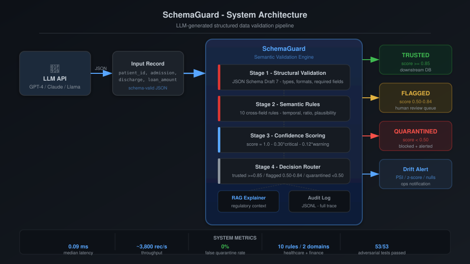
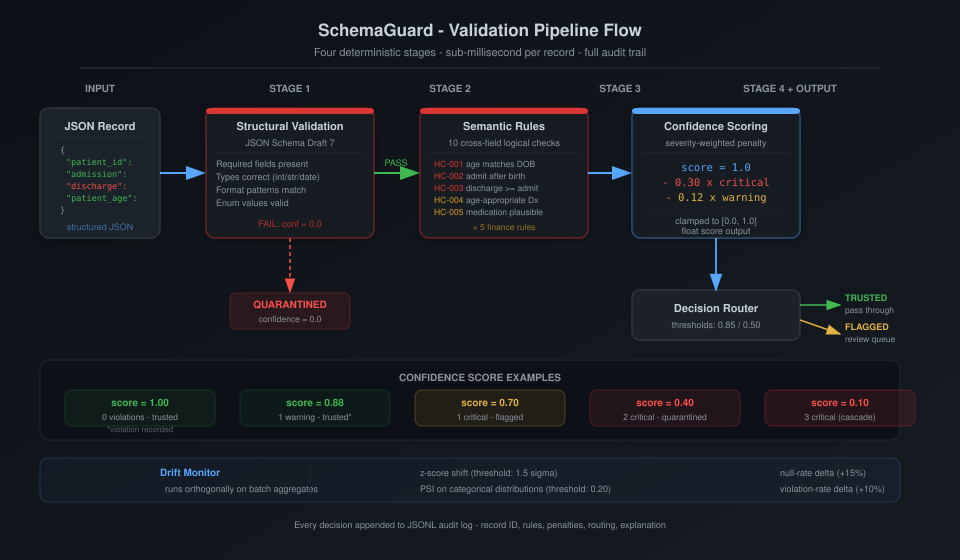
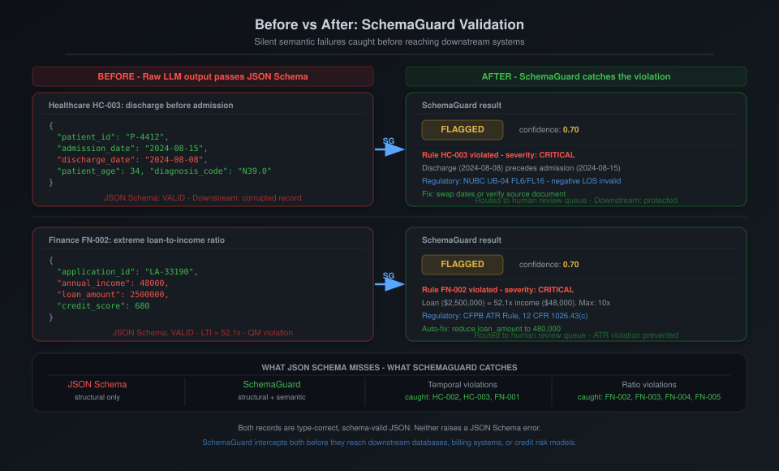
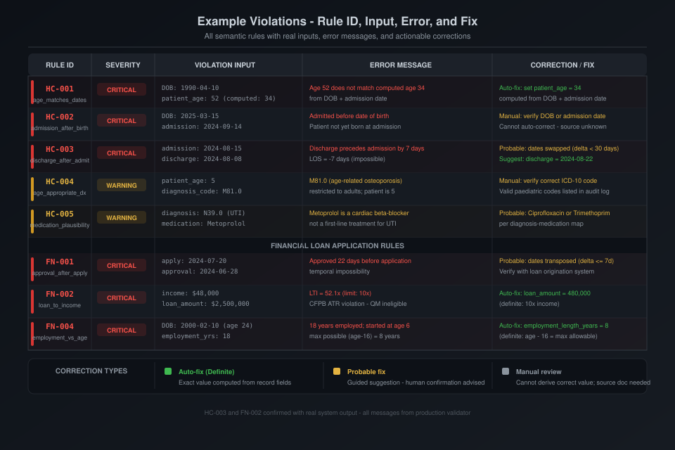

# SchemaGuard — Visual Report Supplement

## Semantic Validation and Drift Detection for LLM-Generated Structured Outputs

---

**Author:** Pragati Narotam  
**Course:** INFO 7375 — Prompt Engineering for Generative AI  
**Institution:** Khoury College of Computer Sciences, Northeastern University  
**Date:** April 2025  
**Full report:** `docs/report/SchemaGuard_Report.md`  
**Diagrams:** `outputs/diagrams/`

---

> **Purpose.** The main report (`SchemaGuard_Report.md`) provides the complete academic write-up.
> This supplement adds four visual sections that make the system's architecture, pipeline logic,
> operational impact, and rule behaviour immediately legible for demos, presentations, and reviews.

---

## Visual Section A · System Architecture

*How the full SchemaGuard system fits together — from LLM API to downstream routing.*



### What the diagram shows

The architecture has three layers:

1. **Input layer** — A raw JSON record produced by an LLM API (GPT-4, Claude, Llama, or any structured-output model) arrives at the SchemaGuard engine. The record is type-correct and schema-conformant; it may still contain cross-field semantic violations invisible to structural validation.

2. **SchemaGuard engine** — Four deterministic stages execute sequentially in under 1 ms:
   - **Stage 1 (Structural)** — JSON Schema Draft 7 validates types, required fields, and formats. Structural failures quarantine the record immediately with confidence = 0.0.
   - **Stage 2 (Semantic)** — Ten cross-field rules evaluate domain-specific logical constraints (temporal consistency, ratio limits, plausibility checks). Rules are registered via decorator and execute inside try/except blocks — a single rule crash does not abort the pipeline.
   - **Stage 3 (Confidence)** — `score = 1.0 − 0.30 × |critical| − 0.12 × |warning|`, clamped to [0.0, 1.0]. Preserves violation severity as a continuous signal.
   - **Stage 4 (Router)** — Routes to trusted (≥ 0.85), flagged (0.50–0.84), or quarantined (< 0.50). Every record also receives a RAG-augmented explanation and is appended to the JSONL audit log.

3. **Output layer** — Three routing tiers plus a drift alert signal. Drift detection runs orthogonally on batch aggregates, not per-record — a batch of entirely trusted records can still trigger a drift alert.

### Key metrics

| Metric | Value |
|---|---|
| Median latency | 0.09 ms |
| Throughput | ~3,800 records/second |
| False quarantine rate | 0% |
| Semantic rules | 10 (5 HC + 5 FN) |
| Adversarial tests | 53/53 passed |

---


## Visual Section B · Validation Pipeline Flow

*The four-stage pipeline — exactly what happens to a record from intake to decision.*



### Stage-by-stage breakdown

**Stage 1 — Structural Validation**  
JSON Schema Draft 7 validates field presence, types, string formats, and enum membership. A structural failure short-circuits all subsequent stages and routes the record to quarantine with confidence = 0.0. This is not redundant with the semantic layer — structural failures are a separate failure class and must be handled first to prevent false semantic rule firing on malformed input.

**Stage 2 — Semantic Rules (10 rules)**  
Cross-field logical constraints that JSON Schema cannot express. Each rule is a Python function registered with a severity tag (`critical` or `warning`). Rules run independently inside try/except blocks — a single rule exception returns a typed error result without aborting the others. The full rule list:

| Domain | Rule | Check |
|---|---|---|
| Healthcare | HC-001 | `patient_age` matches computed age from DOB + admission date (±1 year) |
| Healthcare | HC-002 | `admission_date ≥ date_of_birth` |
| Healthcare | HC-003 | `discharge_date ≥ admission_date` |
| Healthcare | HC-004 | `diagnosis_code` is age-appropriate per ICD-10-CM edits |
| Healthcare | HC-005 | `medication` is plausible for the diagnosis category |
| Finance | FN-001 | `approval_date ≥ application_date` (or null) |
| Finance | FN-002 | `loan_amount / annual_income ≤ 10.0` |
| Finance | FN-003 | `existing_debt / annual_income ≤ 0.60` |
| Finance | FN-004 | `employment_length_years ≤ applicant_age − 16` |
| Finance | FN-005 | `approved_amount ≤ loan_amount` (or null) |

**Stage 3 — Confidence Scoring**  
```
score = 1.0 − 0.30 × |critical violations| − 0.12 × |warning violations|
score = max(0.0, min(1.0, score))
```

Confidence score examples for common violation patterns:

| Violations | Score | Routing |
|---|:---:|:---:|
| 0 violations | 1.00 | trusted |
| 1 warning only | 0.88 | trusted* |
| 1 critical | 0.70 | flagged |
| 2 critical | 0.40 | quarantined |
| 3 critical (cascade) | 0.10 | quarantined |

*\*Warning violations are recorded and included in the audit log; routing does not block the record.*

**Stage 4 — Decision Router**  
Three-tier routing based on the continuous confidence score. Thresholds are configurable via environment variables. The full `ValidationResult` object — including rule IDs, violation messages, field names, and explanation — is always available regardless of routing tier.

**Drift Monitor (orthogonal)**  
Runs on batch aggregates after per-record processing. Four signals: z-score (numeric field means), PSI (categorical distributions), null-rate delta, and violation-rate delta. A batch of entirely trusted records can still trigger a drift alert if population statistics shift beyond threshold.

---


## Visual Section C · Before vs After: SchemaGuard Validation

*The core problem made concrete — what passes without SchemaGuard, what gets caught with it.*



### Healthcare example — HC-003 (discharge before admission)

**The raw LLM output (no validation):**
```json
{
  "patient_id": "P-4412",
  "admission_date": "2024-08-15",
  "discharge_date": "2024-08-08",
  "patient_age": 34,
  "diagnosis_code": "N39.0"
}
```
JSON Schema result: **VALID** ✓ — every field is the correct type and format. The record flows through to the EHR system with a length-of-stay of −7 days, breaking DRG calculation and generating a UB-04 claim that will be rejected by CMS billing systems.

**SchemaGuard output:**
- Decision: **FLAGGED** (confidence: 0.70)
- Rule violated: HC-003 (`discharge_after_admission`) — severity: **CRITICAL**
- Message: `Discharge date (2024-08-08) precedes admission date (2024-08-15)`
- Regulatory reference: NUBC UB-04 FL6/FL16 — negative LOS is invalid for claim adjudication
- Correction: dates appear swapped (delta = 7 days, within 30-day swap threshold) → suggested discharge = 2024-08-22

### Finance example — FN-002 (extreme loan-to-income ratio)

**The raw LLM output (no validation):**
```json
{
  "application_id": "LA-33190",
  "annual_income": 48000,
  "loan_amount": 2500000,
  "credit_score": 680
}
```
JSON Schema result: **VALID** ✓ — all integers, all in range. The application flows to underwriting with a loan-to-income ratio of 52.1× — more than five times the CFPB Ability-to-Repay regulatory maximum of 10×.

**SchemaGuard output:**
- Decision: **FLAGGED** (confidence: 0.70)
- Rule violated: FN-002 (`loan_to_income_ratio`) — severity: **CRITICAL**
- Message: `Loan amount ($2,500,000) is 52.1× annual income ($48,000), exceeds 10.0× limit`
- Regulatory reference: CFPB ATR Rule, 12 CFR §1026.43(c)
- Auto-correction: `loan_amount = $480,000` (10× income — exact value computed, confidence: definite)

### The gap this closes

Both records above are **structurally valid**. They contain no missing fields, no type errors, no format violations. They would pass every existing JSON Schema check and flow silently into downstream systems:

| Without SchemaGuard | With SchemaGuard |
|---|---|
| HC-003 enters EHR → DRG miscalculation | Routed to human review queue |
| FN-002 enters underwriting → ATR violation | Blocked + auto-fix suggested |
| No audit trail | Full JSONL audit record |
| Silent failure | Explanation citing regulation by section |

---


## Visual Section D · Example Violations Table

*All 8 rules shown with real inputs, real error messages, and actionable corrections.*



### Table summary

The table captures all 8 rules with concrete violation examples drawn from the evaluation dataset. Each row shows:

- **Rule ID** — the registered identifier in the rule registry
- **Severity** — `CRITICAL` (penalty −0.30) or `WARNING` (penalty −0.12)
- **Violation input** — the specific field values that triggered the rule
- **Error message** — the exact message produced by the production pipeline
- **Correction / Fix** — what the suggestion engine recommends, with confidence tier

### Correction confidence tiers

The correction suggestion engine (`suggestions/engine.py`) assigns one of three confidence tiers to each fix:

**Definite** — The exact correct value is computed directly from the record:
- HC-001: `patient_age` recomputed from `date_of_birth` + `admission_date`
- FN-002: `loan_amount` capped at `annual_income × 10`
- FN-004: `employment_length_years` capped at `age − 16`
- FN-005: `approved_amount` set to `loan_amount`

**Probable** — A strongly guided suggestion; human confirmation is advised before applying:
- HC-003: date swap detection (if delta ≤ 30 days)
- HC-005: first-line medication from diagnosis-category map
- FN-001: transposition detection (if delta ≤ 7 days)

**Manual** — The system cannot derive the correct value from the record alone; source document verification is required:
- HC-002: impossible to determine which of DOB or admission date is erroneous
- HC-004: alternative ICD-10 code must be confirmed against clinical context

### RAG-augmented explanations

For every flagged or quarantined record, the explanation layer retrieves relevant chunks from an 11-document knowledge base (clinical guidelines, regulatory standards) using a FAISS vector index (`all-MiniLM-L6-v2`, 384-dim, cosine similarity). The RAG explanation consistently includes:

1. Exact field values from the record
2. Regulation name and section number (e.g., CFPB ATR Rule 12 CFR §1026.43)
3. Clinical or legal downstream consequence
4. A specific, source-verifiable remediation step

Baseline template explanations scored 2.71/6 on a 6-criterion rubric. RAG explanations scored 6.0/6 across all 7 live-evaluated cases.

---

## Diagram File Reference

| Diagram | File | Description |
|---|---|---|
| A | `outputs/diagrams/A_system_architecture.svg` | Full system from LLM API to three-tier output routing |
| B | `outputs/diagrams/B_validation_pipeline.svg` | Four-stage pipeline with confidence scoring examples |
| C | `outputs/diagrams/C_before_after.svg` | HC-003 and FN-002 before/after comparison with real data |
| D | `outputs/diagrams/D_violations_table.svg` | All 8 rules: input → violation message → correction |

All diagrams are production SVG, dark-themed, 960px wide, and render correctly in any browser, PDF viewer, or Markdown renderer that supports inline SVG or image embedding.

To embed in presentations: export each SVG to PNG at 2× resolution using `rsvg-convert`, Inkscape, or any browser's print-to-PDF.

---

## Relationship to Main Report

This visual supplement corresponds to sections in `SchemaGuard_Report.md`:

| Visual section | Report section |
|---|---|
| A — System Architecture | §3 · System Architecture |
| B — Pipeline Flow | §3.1 Pipeline Overview + §4.4 Validation Pipeline |
| C — Before vs After | §2.1 The Structural Validation Gap |
| D — Violations Table | §4.4.2 The Ten Rules + §5.4 Adversarial Evaluation |

---

*SchemaGuard · Pragati Narotam · INFO 7375 Prompt Engineering for GenAI · Northeastern University · 2025*
